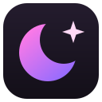

# Quiet Tab for Linux

A minimal, curated New Tab page that **takes its colours from your wallpaper, or straight from
[matugen](https://github.com/InioX/matugen)**, so it matches the rest of your desktop exactly. It works in any
Chromium browser on Linux: Helium, Chrome, Chromium, Brave, Vivaldi, Edge and others. It's the Linux version of
[Quiet Tab for Windows](https://github.com/SammyNashed/quiet-tab-windows).

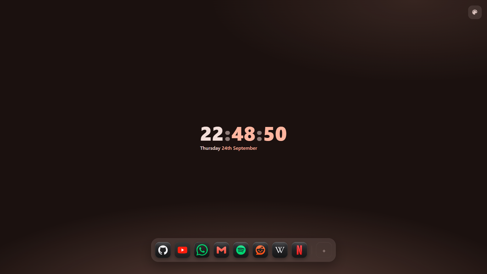

- **Matches your desktop exactly.** With matugen, the page uses the very colours matugen generated for your bar,
  terminal and everything else — same scheme, same style. Change the wallpaper and every open New Tab recolours
  within a couple of seconds.
- **Or follows the wallpaper itself.** Works with awww/swww, hyprpaper, waypaper, and GNOME/Cinnamon/MATE
  backgrounds, no matugen needed.
- **Built-in colour picker.** Choose any of the colours pulled from the wallpaper, or click anywhere on the wallpaper
  preview to use that exact spot. You can also pick your own colour (colour wheel, presets, or *Pick from screen*),
  or upload any picture.
- **Nine Material You styles**, using the same colour engine as matugen: Tonal spot, Vibrant, Expressive, Fidelity,
  Content, Rainbow, Fruit salad, Neutral and Monochrome, plus *Exact colour*, and dark, light or follow-the-system.
- **Its own tab icon** that takes on your current accent colour, so even the tab strip matches.
- **Your own shortcuts, with 3,400+ bundled icons in six styles.** By default they look like **iOS 26 dark-mode**
  icons: each logo in its own colour on a dark glass tile. You can also choose *Brand colour*, *Themed* (tinted to
  your colours), *Accent*, *Monochrome* or *Logo only*, each with a live preview of your own shortcuts. No tracking
  and no "most visited".

<p>
  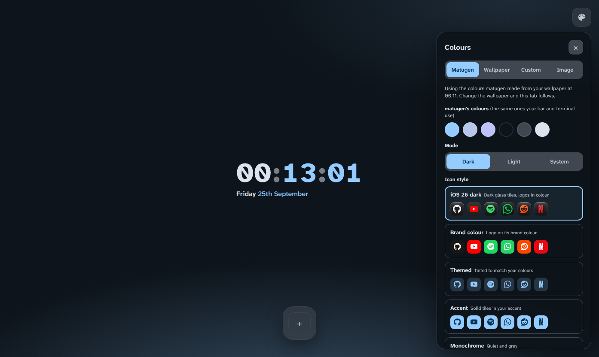
</p>

| | |
|---|---|
| 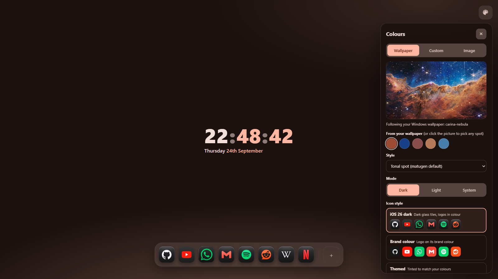 | 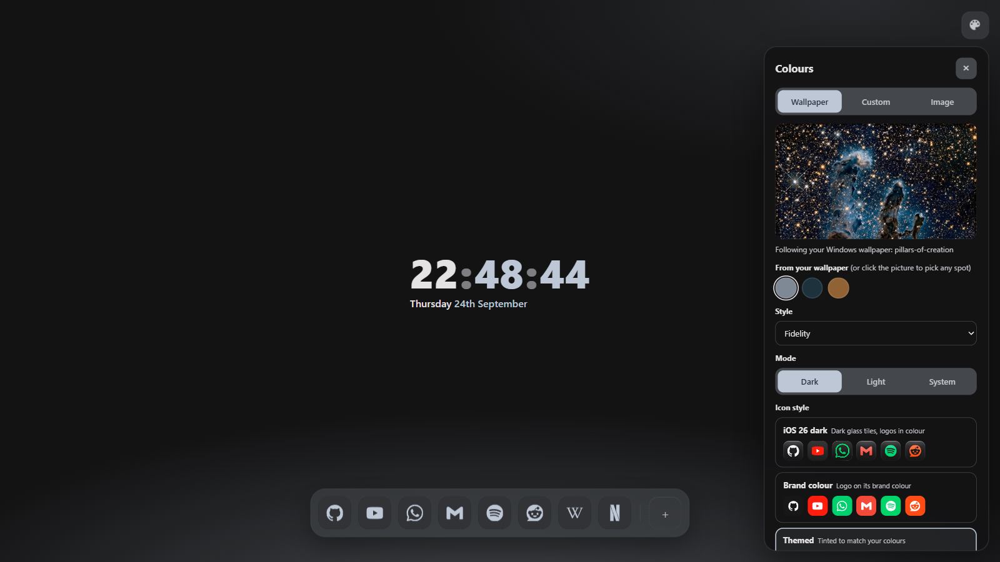 |
| Carina Nebula · *Tonal spot* · iOS 26 dark icons | Pillars of Creation · *Fidelity* · Themed icons |
| 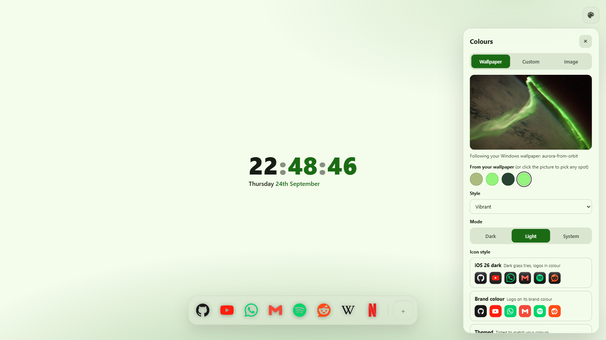 | 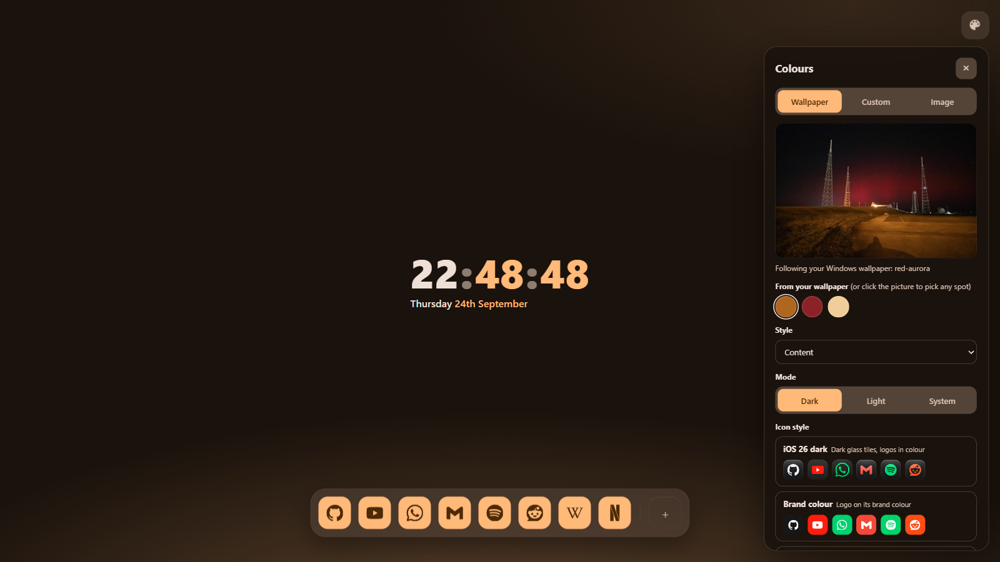 |
| Aurora from orbit, second swatch picked · *Vibrant*, light · Logo only | Red aurora · *Content* · Accent icons |
| 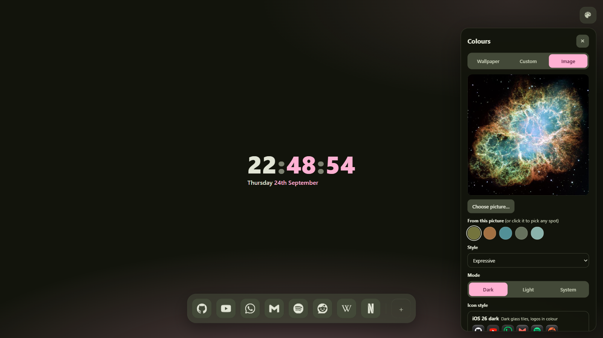 | 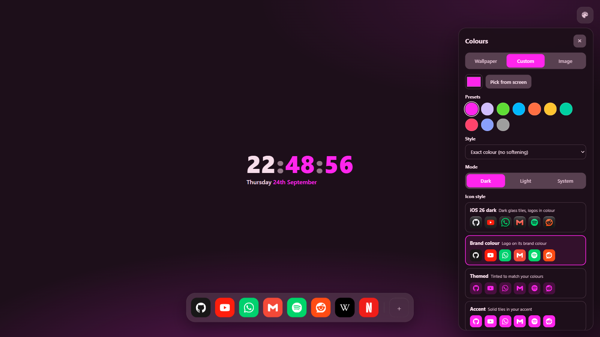 |
| An uploaded picture (Crab Nebula) · *Expressive* · Monochrome icons | Custom colour · *Exact colour* · Brand colour icons |

## Shortcut icons

<p>
  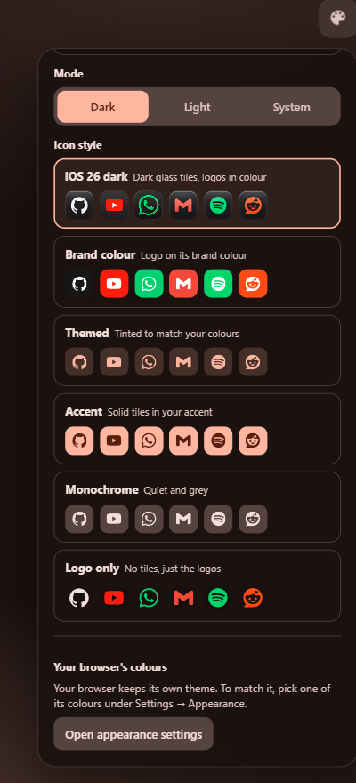
  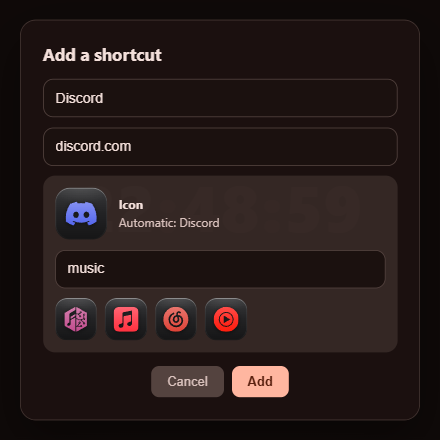
</p>

- The extension ships with the whole [Simple Icons](https://simpleicons.org) set: 3,400+ brand logos, each with its
  official colour, also included one file per logo in `icons/brands/` (for example `github.svg`).
- Pick a style under **Icon style** in the colour panel; every option previews your own shortcuts.
- Adding a shortcut (**+**) or editing one (the **✎** that appears on hover) shows its icon straight away. Keep
  *Automatic* (matched from the address, for example `mail.google.com` → Gmail) or search the library.
- A few big brands don't allow their logos in Simple Icons (Microsoft, Amazon, LinkedIn, OpenAI, Slack). Those get a
  lettered tile unless you pick a logo for them.
- Coming from Quiet Tab 1.x? Keep the folder where it is and press the extension's reload arrow: your shortcuts stay
  and get icons automatically.

## Install

1. **Get the files** somewhere they can stay, for example:
   ```sh
   git clone https://github.com/SammyNashed/quiet-tab-linux ~/newtab
   ```
   (or download `QuietTab-Linux-<version>.zip` from the
   [latest release](https://github.com/SammyNashed/quiet-tab-linux/releases/latest) and unzip it). Don't delete the
   folder afterwards; the browser loads the extension from it.
2. **Run `./install.sh`.** It registers the small helper (one Python file, no dependencies beyond Python 3) with every
   Chromium browser it finds, and, if you have matugen, adds a Quiet Tab template to `~/.config/matugen/config.toml`
   and makes the first colours. It only reads your wallpaper and colours; it never changes the browser.
3. **Load the extension.** Open your browser's extensions page (`chrome://extensions`, `brave://extensions`, …), turn
   on **Developer mode**, click **Load unpacked**, and choose the folder from step 1.
4. **Open a new tab.** If the browser asks whether to keep the changed New Tab page, keep it. Then click the palette
   button in the top-right corner.

Skipping step 2 still gives you everything except following the wallpaper and matugen; the page says so.
`./install.sh --uninstall` removes the helper and the matugen template again.

The extension's ID comes from the folder's path. If you move the folder, load it again and re-run `./install.sh`.

## Extras for Helium (optional)

`matugen-integration/` also has two Helium-specific pieces from Quiet Tab 1.x, if you want the browser itself to match:

- `set_helium_accent.py`: run from a matugen `post_hook` with `{{colors.primary.default.hex}}`; sets Helium's own
  accent colour (`browser.theme.user_color2`) to match.
- `gtk-selection-colors.css`: GTK colour names Helium reads for its text selection highlight.

## How it works

| Piece | What it does |
|---|---|
| `newtab.*`, `background.js` | The New Tab page, plus a background worker that turns the colour source into a palette. |
| `helper/quiet-tab-helper.py` | A [native messaging](https://developer.chrome.com/docs/extensions/develop/concepts/native-messaging) host the browser starts on demand. It finds the current wallpaper and sends a small thumbnail, and sends matugen's colours from `~/.cache/quiet-tab/colors.json`, whenever either changes. `--check` prints what it sees. |
| `matugen-integration/quiet-tab-colors.json` | The matugen template: writes both the dark and light roles, so the page's dark/light/system modes all stay exact. |
| `icons.js` + `icons/library.json` | The icon library (built from Simple Icons by `tools/build-icon-library.mjs`), domain matching, and the six icon styles. |
| `palette.js` | Wallpaper → seed colours (Celebi quantizer + Score, as in matugen) → Material You scheme, for every source except Matugen. |

## Credits

- Colour science: Google's [material-color-utilities](https://github.com/material-foundation/material-color-utilities)
  (Apache 2.0), bundled as `vendor/mcu.js`.
- Screenshot wallpapers: public-domain images from the [NASA Image and Video Library](https://images.nasa.gov).
- Shortcut icons: [Simple Icons](https://github.com/simple-icons/simple-icons) (CC0), bundled as
  `icons/library.json`. The logos are trademarks of their owners and are shown only to identify each site.
- The hand-made iOS-style WhatsApp and YouTube icons in `icons/apps/` come from third-party icon packs.

## License

MIT, see [LICENSE](LICENSE).
